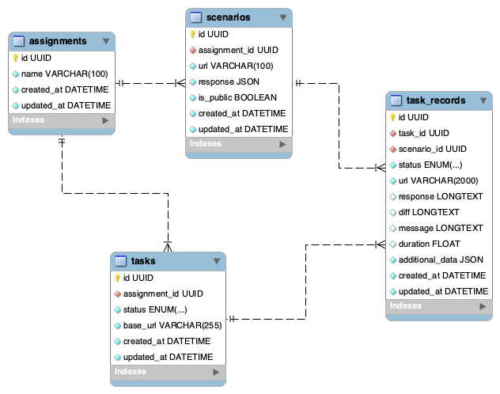

# TesterDBS

A tool for automating the testing process for database assignments in the Database Technologies course at the Slovak
University of Technology.

The tool takes a student's Docker container as input, creates a sandbox environment using Docker, and executes
predefined testing scenarios consisting of HTTP requests and their expected responses. The output is a comparison
of the actual responses generated by the student's image and the expected responses. The tool utilizes Docker and
Redis for efficient processing.

## Install

Application use these environments variables:

| Variable                 | Description                              | Default                           | Example                            |
|--------------------------|------------------------------------------|-----------------------------------|------------------------------------|
| `BASE_URL`               | Base URL of the application              | -                                 | `https://tester-dbs.fiit.stuba.sk` |
| `ALLOWED_HOSTS`          | Allowed hosts (Django Setting)           | -                                 | `tester-dbs.fiit.stuba.sk`         |
| `DATABASE_HOST`          | Database server location                 | -                                 | `docker.for.mac.localhost`         |
| `DATABASE_NAME`          | Database name                            | -                                 | `tester`                           |
| `DATABASE_PASSWORD`      | Database user password                   | `super-secure-password`           |                                    |
| `DATABASE_PORT`          | Database port                            | `5432`                            | `5432`                             |
| `DATABASE_USER`          | Database user                            | -                                 | `tester`                           |
| `DJANGO_SETTINGS_MODULE` | Django Settings Module                   | `dbs_tester.settings.development` | `dbs_tester.settings.production`   |
| `REDIS_HOST`             | Redis host                               | `host.docker.internal`            | `host.docker.internal`             |
| `REDIS_DB`               | Redis database                           | `0`                               | `0`                                |
| `REDIS_DB`               | Redis database                           | `0`                               | `0`                                |
| `REDIS_DB`               | Redis database                           | `0`                               | `0`                                |
| `SECRET_KEY`             | Django secret                            | -                                 | `ghp_asdqwjdsncvsdv`               |
| `GITHUB_TOKEN`           | GitHub token                             | -                                 | `Secure-random-string-21`          |
| `GITHUB_USER`            | GitHub username                          | -                                 | `Sibyx`                            |
| `DBS_DOCKER_NETWORK`     | Docker network for assignment containers | `dbs`                             | `dbs`                              |

### Docker

Pre-build Docker image is available on GitHub Container registry as
[ghcr.io/fiit-databases/tester:master](https://github.com/FIIT-Databases/tester/pkgs/container/tester).

To run the image as a container you can use command bellow (keep in mind that you have to specify the environment
variables accordingly). The logs from container are present in the `/var/log` so you have to create a volume to access
them (present in the example).

The container requires access to the Docker environment that's why you have to create volume, which maps a path to the
Docker socket.

Docker network have to be created and provided to the application using `DBS_DOCKER_NETWORK` environment variable.
Network `dbs` is used in the example

```shell
docker run -p 9000:9000 -v /var/run/docker.sock:/var/run/docker.sock -v ./logs:/var/log/ --env BASE_URL= --env ALLOWED_HOSTS= --env DATABASE_HOST= --env DATABASE_NAME= --env DATABASE_PASSWORD= --env DATABASE_PORT= --env DATABASE_USER= --env DJANGO_SETTINGS_MODULE=dbs_tester.settings.production --env REDIS_HOST= --env SECRET_KEY= --env GITHUB_TOKEN= --env GITHUB_USER= --name dbs-tester --network dbs --add-host=host.docker.internal:host-gateway ghcr.io/fiit-databases/tester:master
```

Server started on port 9000.

Repository contains an example of the **systemd unit script** in the `conf/tester-dbs.service`.

### From source

We use [poetry](https://python-poetry.org/) for dependency management and [PostgreSQL](https://www.postgresql.org/) 15
(10+ should be compatible) as a data storage (acquisition files are stored on the filesystem, not in the database).
To set up instance with demo database follow these simple steps:

1. Create python virtual environment (`python -m venv venv`)
2. Enter environment (`source venv/bin/activate`)
3. Install dependencies `poetry install`
4. Create `.env` file according `.env.example`
5. Execute migrations `python manage.py migrate`
6. Create superuser using `python manage.py createsuperuser` or setup LDAP in `auth_sources` table

## Database

This project requires PostgresSQL 10+ database server to run. Here is the EER diagram bellow.



---
Made with ❤️ and ☕️ FIIT STU (c) 2022-2023
