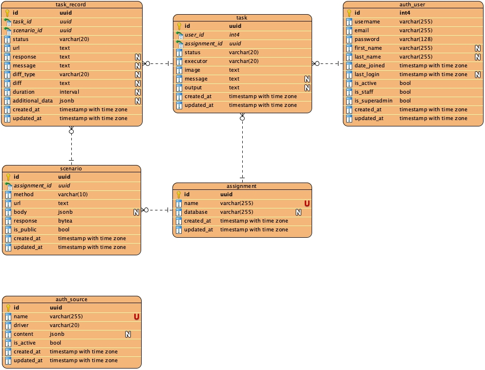

# Tester docs

## Component diagram

The entire project is shown in the component diagram below. The Tester package represents our application. We use
PostgreSQL for data storage, Redis for the queue, and Docker for containerization.

## User workflow

When students submit a URL to their Docker image, details are saved in the database and a task is added to the Redis
queue. The student is then redirected to the detail page of the Task, which refreshes periodically and shows the
current status of the task (including its results if finished).

## Worker

The worker creates a Docker container for the student from the provided image and performs a series of pre-defined URL
requests. The results are saved to the database.

## Database

This project requires PostgresSQL 10+ database server to run. Here is the EER diagram bellow.

